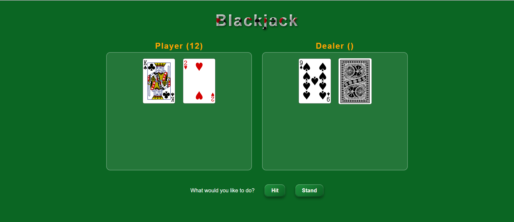
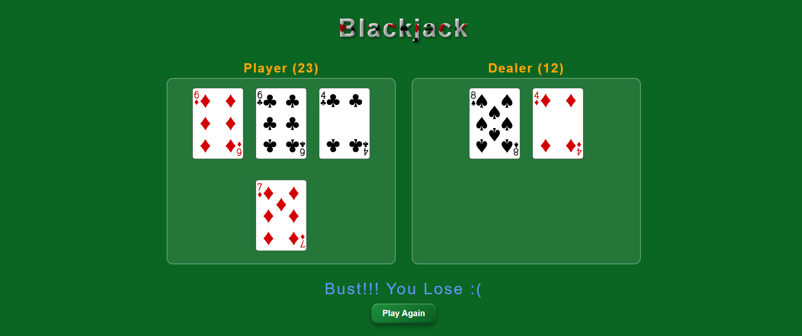
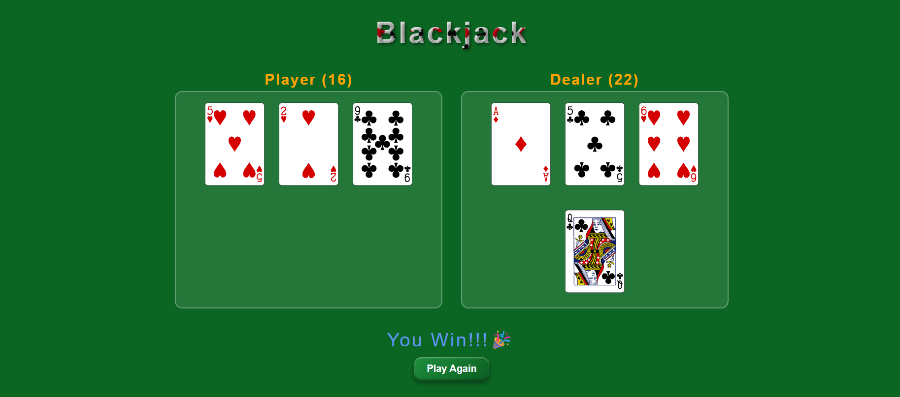
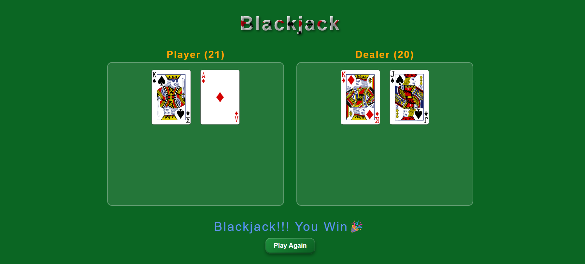
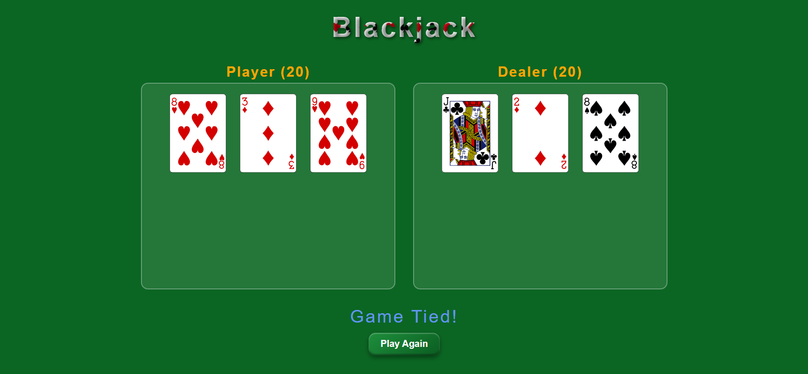

# Blackjack Game

A browser-based game built using **vanilla JavaScript**, implementing core casino rules with a focus on clean game logic and API-driven card handling.

---

## Features

**Standard Blackjack Gameplay**
  - Player vs Dealer
  - 52-card deck
  - Real-time score calculation

**Player Actions**
  - **Hit** – Draw another card
  - **Stand** – End turn and allow dealer to play

**Dealer Logic**
  - Implements **Soft 17 rule (H17)**  
    - Dealer **hits on soft 17**
    - Dealer **stands on hard 17 or higher**

**Card API Integration**
  - Uses a public **Cards API** to:
    - Shuffle decks
    - Draw cards
    - Ensure randomness and correctness

**Pure Vanilla JavaScript**
  - No frameworks or libraries
  - DOM manipulation using native JS

---

## 💻 Screenshots

---

## 📄 License

This project is licensed under the [MIT License](https://opensource.org/licenses/MIT).

